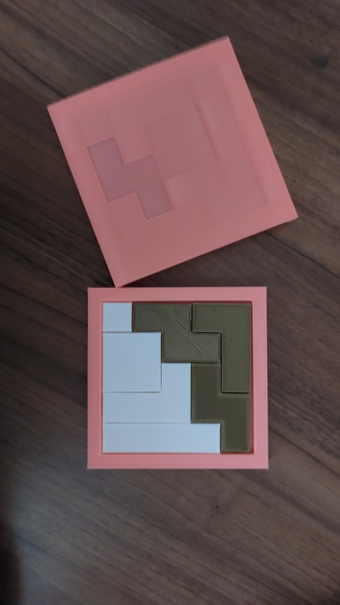
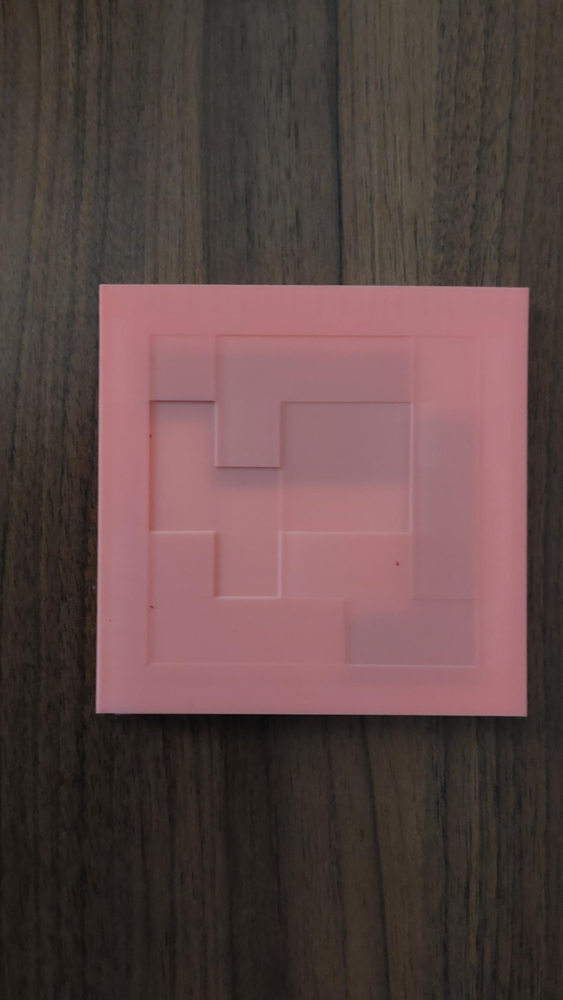

[Czech](README.cz.md)

# Tetris minigame

I made a Tetris like game where your goal is to fill as much rows as you possibly can with pieces of puzzle you have.

### Materials:
- PLA  filament

### Cost:
91 Kč | 3,83 Euro | 4,1 USD (05. 06. 2023)

### How to print:
1. Download all **STL** files in repository
2. Print all downloaded files
	##### In printing software:
 	 - set fill to 10%-15%
 	 - if you want you can make print bigger, but default size is **big enough**

	##### Printing speeed:
  - Top for box: around 2 hours
  - Box for tangram: roughly 3 hours
  - All tangram pieces: 1 - 1,5 hours

### Setup of tangram:

1. In the box assemble all pieces of tangram (completed tangram is in  the repository)
2. Slide the top on the box to close it.

